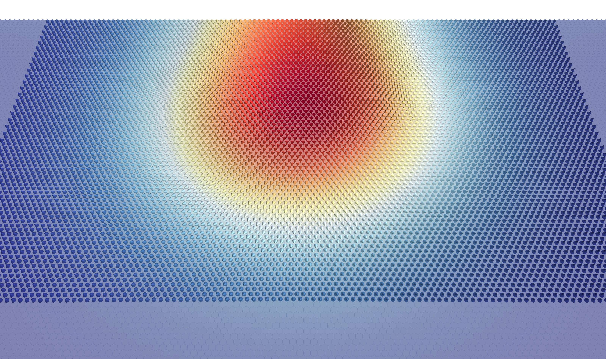

# NEBM Simulations

This repository contains all the necessary scripts to run the Nudged Elastic
Band method (NEBM) atomistic simulations, using
[Fidimag](http://computationalmodelling.github.io/fidimag/).

## System

The system under study is an ``80 nm X 40 nm X 0.25 nm`` cobalt nanotrack which
is translated into a lattice of ``320 X 185`` spins which are hexagonally
arranged. 

Magnetic parameters are:

    D     :: VARIABLE meV   DMI constant
    J     :: 27.026   meV   Exchange constant
    mu_s  :: 0.846    mu_B  Magnetic moment (in Bohr magneton units)
    k_u   :: 0.0676   meV   Anisotropy

The simulations are specified for different DMI constants. Folders and scripts
have the ``D`` parameter in ``J m**-2`` which, in the atomistic simulations,
have the following equivalences:

    Micromagnetic           Atomistic

    D = 26e-4 J m**-2  -->  D = 0.586 meV
    D = 28e-4 J m**-2  -->  D = 0.631 meV
    D = 30e-4 J m**-2  -->  D = 0.676 meV
    D = 32e-4 J m**-2  -->  D = 0.721 meV
    D = 34e-4 J m**-2  -->  D = 0.766 meV
    D = 36e-4 J m**-2  -->  D = 0.811 meV
    D = 38e-4 J m**-2  -->  D = 0.856 meV

## Simulations

There are three different NEBM simulations:

1. Skyrmion annihilation at the boundary

2. Skyrmion collapse or skyrmion destruction by a singularity, from linear
interpolations as initial state

3. Climbing image NEBM for the NEBM simulations of 2., which results in the
skyrmion collapse 

For simulation 2., we can obtain either a skyrmion collapse transition or a
skyrmion destruction by a singularity. The latest is observed for DMI
magnitudes equal or larger than ``0.721 meV``.

# Instructions

To run the simulations, we need:

1. Run the relaxation scripts in ``sims/relaxation/`` to obtain both, the
skyrmion and ferromagnetic states as ``npy`` files. There is a script for every
magnetic configuration and DMI constant. Hence, if we want the simulations for
``D=0.721 meV``, for example, we need to run

    bash stripe_320x185_Co_fm-up_D32e-4_h25e-2nm.sh
    bash stripe_320x185_Co_sk-down_D32e-4_h25e-2nm.sh

2. With the relaxed states we can now run the NEBM simulations in
``sims/nebm``.  Since we have 3 different simulations we have three options:

## 1. Boundary Annihilation

For this we need to manually generate the initial state for the NEBM. Thus,
following the previous example, if we want to run the simulation for 
``D=0.721 meV``, we need to 
        
i. Move to ``sims/nebm/neb_stripe_320x185_Co_sk-down_fm-up_D32e-4_h25e-2nm_GEODESIC``

ii. Run the ``generate_sk-disp_initial_state.sh`` script. This will create
an ``sk_disp_npys`` folder with the images for the NEBM initial state

iii. Run the ``initiate_simulation_skdisp_k1e4.sh`` script. This will generate
the ``neb_stripe_320x185_Co_sk-down_fm-up_D32e-4_h25e-2nm_GEODESIC_energy.ndt`` and
``neb_stripe_320x185_Co_sk-down_fm-up_D32e-4_h25e-2nm_GEODESIC_dYs.ndt`` files with
the data of the energy bands for every iteration of the NEBM.

## 2. Linear interpolations

For this case, the initial state for the NEBM, which are linear interpolations
on the spherical angles that define the spins directions, is automatically
generated.  Thus it is only necessary to move to the simulation folder, for
example,
``sims/nebm/neb_stripe_320x185_Co_sk-down_fm-up_D32e-4_h25e-2nm_GEODESIC``, and
run the ``initiate_simulation_k1e4.sh`` script. As we mentioned before, some
simulations will relax towards a skyrmion collapse and others to the
destruction mediated by a singularity.

## 3. Climbing image NEBM

These simulations are the continuation of the **Linear interpolations**
simulations.  Since the climbing image is based on taking the largest energy
image in the band and redefining the forces on it, we need to identify this
point.

According to our results, we have already identified the climbing images and
they are specified on every simulation script (we expect that anyone who runs
the simulations will also obtain the same largest energy points). Thus,
following the previous examples, if we want to run the simulation for 
``D=0.721 meV``, we need to first run the corresponding **Skyrmion collapse**
simulation and then the ``initiate_simulation_climbing-15_k1e4.sh`` script,
which uses the 15th image of the band as climbing image.
